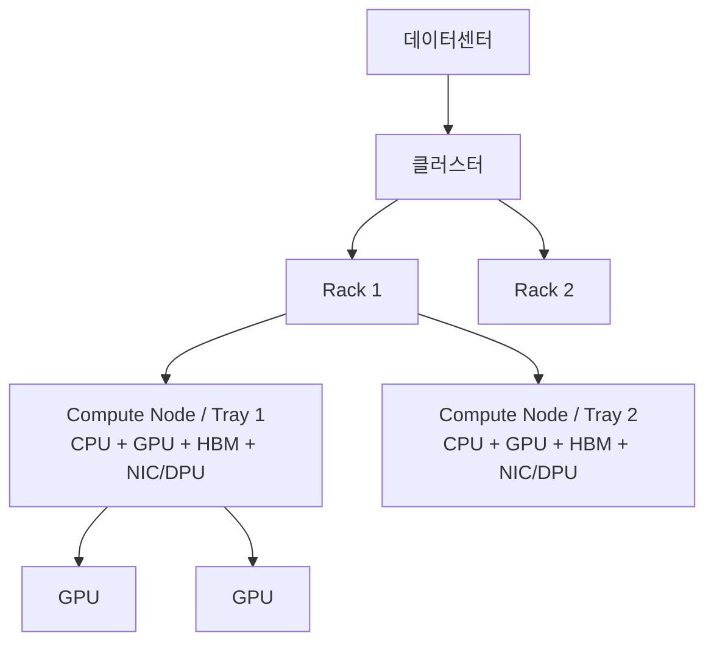
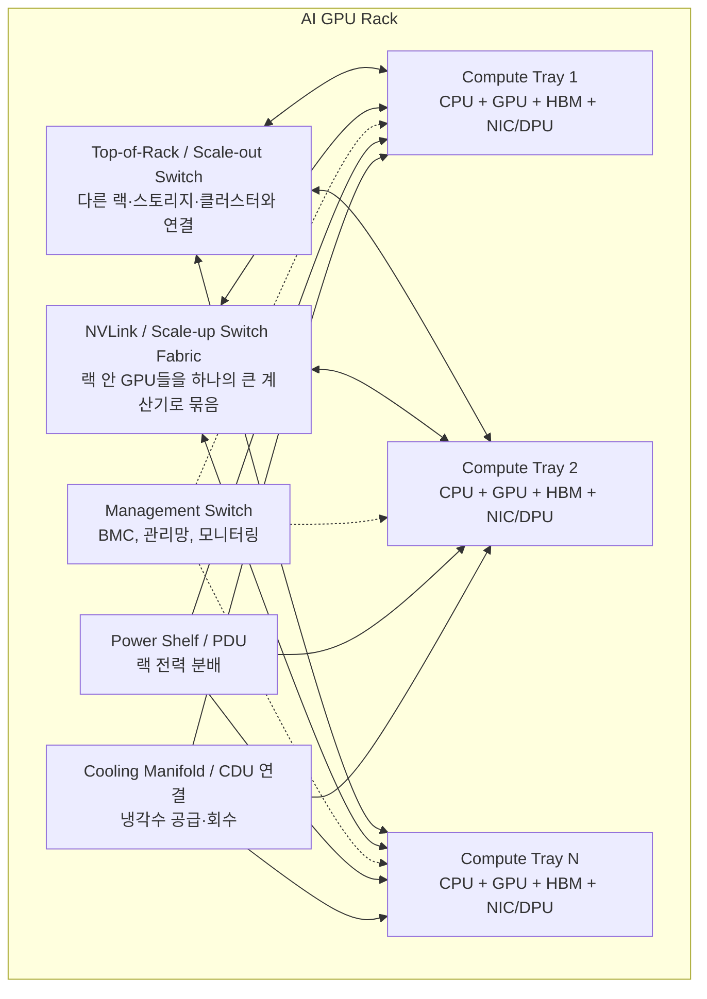

# AI 데이터센터 랙 계층과 구성도

## 핵심 요약

AI 데이터센터의 물리 최소 단위는 보통 랙이 아니라 **서버/노드/compute tray**다. 랙은 여러 노드, 스위치, 전력 분배, 냉각 장치를 한 캐비닛에 넣은 운영·배치 단위다.

다만 NVIDIA GB200 NVL72 같은 랙 스케일 시스템은 랙 전체를 하나의 큰 GPU 도메인처럼 묶도록 설계한다. 그래서 물리적으로는 여러 노드가 있지만, 논리적 계산 단위는 랙 수준까지 커질 수 있다.

## 계층도

### 계층별 의미

| 계층 | 의미 |
|------|------|
| 데이터센터 | 전력, 냉각, 건물, 보안, 운영 전체 |
| 클러스터 | 여러 랙을 묶은 학습/추론 자원 풀 |
| 랙 | 여러 노드, 스위치, 전력, 냉각을 담은 캐비닛 |
| Compute node/tray | CPU, GPU, HBM, NIC/DPU를 가진 실제 컴퓨터 단위 |
| GPU | 행렬 연산을 수행하는 핵심 가속기 |
| HBM | GPU 가까이에 붙은 초고속 메모리 |

## 한 랙의 구성도

## 랙을 읽는 법

랙은 부품 목록보다 **흐름**으로 읽는 것이 좋다.

1. **계산 흐름**: CPU가 일을 준비하고 GPU가 행렬 연산을 수행한다.
2. **메모리 흐름**: HBM이 모델 파라미터, activation, KV cache를 GPU 가까이에 둔다.
3. **통신 흐름**: GPU끼리, 노드끼리, 랙끼리 데이터를 주고받는다.
4. **전력 흐름**: 외부 전력이 랙으로 들어와 각 트레이와 스위치에 분배된다.
5. **열 흐름**: GPU/CPU/스위치에서 발생한 열이 공기 또는 냉각수로 빠져나간다.
6. **관리 흐름**: BMC, 관리망, 센서, 펌웨어, 모니터링이 상태를 감시하고 제어한다.

## 네트워크 구분

| 구분 | 역할 | 예 |
|------|------|----|
| Scale-up network | 랙 안 GPU들을 하나의 큰 계산기처럼 묶음 | NVLink, NVSwitch |
| Scale-out network | 랙과 랙, 랙과 스토리지를 묶음 | InfiniBand, 고성능 Ethernet |
| Management network | 전원, 온도, 장애, 펌웨어, BMC 제어 | 관리 스위치, BMC |

### BMC

**BMC**는 Baseboard Management Controller의 약자다. 서버 메인보드에 붙은 작은 관리용 컨트롤러로, 메인 CPU/OS가 죽어도 별도의 관리망을 통해 서버 상태를 읽고 전원 제어 같은 작업을 할 수 있게 해준다.

BMC가 다루는 것:

- 전원 on/off/reboot
- 온도, 팬, 전압, 전력 상태
- 하드웨어 장애 로그
- 펌웨어/BIOS 관리
- 원격 콘솔
- OS가 부팅되지 않아도 상태 확인

## 전력과 냉각 용어

- **PDU**: Power Distribution Unit. 랙으로 들어온 전력을 서버, 스위치, 냉각 관련 장치에 나눠주는 전력 분배 장치.
- **CDU**: Coolant Distribution Unit. 시설 냉각수 루프와 랙/서버 내부 냉각 루프 사이에서 냉각수를 분배하고, 온도·압력·유량을 제어하는 장치.

## CPU의 역할

CPU는 GPU의 보스라기보다 **작업 관리자/호스트**에 가깝다.

- 데이터 로딩
- 전처리
- 학습/추론 프로세스 실행
- GPU 커널 실행 지시
- 작업 스케줄링
- 네트워크/스토리지 I/O 조율
- checkpoint 저장/로드
- 장애 처리
- OS, 드라이버, 런타임 관리

## 한 줄 요약

> AI 랙은 여러 서버를 담은 캐비닛이지만, 고속 네트워크·전력·냉각·관리 시스템을 통해 하나의 거대한 계산기처럼 동작하도록 설계된 물리 단위다.
