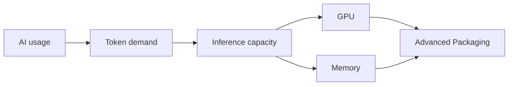

# AI Semiconductor Demand Chain

Evergreen reference for how AI usage can translate into semiconductor demand.

Use this note for stable concepts, definitions, and causal links. Time-sensitive claims and source-backed measurements should remain in dated reports and their report-local `data/metrics.json`.

